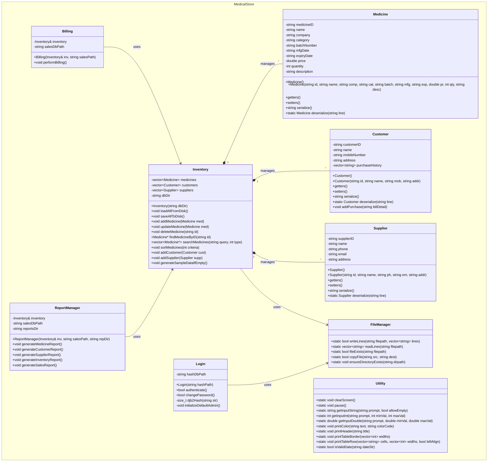

# Class Diagram

Below is the PlantUML/Mermaid representation of the system classes, methods, and relationships.

```mermaid
classDiagram
    namespace MedicalStore {
        class Medicine {
            -string medicineID
            -string name
            -string company
            -string category
            -string batchNumber
            -string mfgDate
            -string expiryDate
            -double price
            -int quantity
            -string description
            +Medicine()
            +Medicine(string id, string name, string comp, string cat, string batch, string mfg, string exp, double pr, int qty, string desc)
            +getters()
            +setters()
            +string serialize()
            +static Medicine deserialize(string line)
        }

        class Customer {
            -string customerID
            -string name
            -string mobileNumber
            -string address
            -vector~string~ purchaseHistory
            +Customer()
            +Customer(string id, string name, string mob, string addr)
            +getters()
            +setters()
            +string serialize()
            +static Customer deserialize(string line)
            +void addPurchase(string billDetail)
        }

        class Supplier {
            -string supplierID
            -string name
            -string phone
            -string email
            -string address
            +Supplier()
            +Supplier(string id, string name, string ph, string em, string addr)
            +getters()
            +setters()
            +string serialize()
            +static Supplier deserialize(string line)
        }

        class FileManager {
            +static bool writeLines(string filepath, vector~string~ lines)
            +static vector~string~ readLines(string filepath)
            +static bool fileExists(string filepath)
            +static bool copyFile(string src, string dest)
            +static void ensureDirectoryExists(string dirpath)
        }

        class Inventory {
            -vector~Medicine~ medicines
            -vector~Customer~ customers
            -vector~Supplier~ suppliers
            -string dbDir
            +Inventory(string dbDir)
            +void loadAllFromDisk()
            +void saveAllToDisk()
            +void addMedicine(Medicine med)
            +void updateMedicine(Medicine med)
            +void deleteMedicine(string id)
            +Medicine* findMedicineByID(string id)
            +vector~Medicine*~ searchMedicines(string query, int type)
            +void sortMedicines(int criteria)
            +void addCustomer(Customer cust)
            +void addSupplier(Supplier supp)
            +void generateSampleDataIfEmpty()
        }

        class Billing {
            -Inventory& inventory
            -string salesDbPath
            +Billing(Inventory& inv, string salesPath)
            +void performBilling()
        }

        class ReportManager {
            -Inventory& inventory
            -string salesDbPath
            -string reportsDir
            +ReportManager(Inventory& inv, string salesPath, string repDir)
            +void generateMedicineReport()
            +void generateCustomerReport()
            +void generateSupplierReport()
            +void generateInventoryReport()
            +void generateSalesReport()
        }

        class Login {
            -string hashDbPath
            +Login(string hashPath)
            +bool authenticate()
            +bool changePassword()
            -size_t djb2Hash(string str)
            -void initializeDefaultAdmin()
        }

        class Utility {
            +static void clearScreen()
            +static void pause()
            +static string getInputString(string prompt, bool allowEmpty)
            +static int getInputInt(string prompt, int minVal, int maxVal)
            +static double getInputDouble(string prompt, double minVal, double maxVal)
            +static void printColor(string text, string colorCode)
            +static void printHeader(string title)
            +static void printTableBorder(vector~int~ widths)
            +static void printTableRow(vector~string~ cells, vector~int~ widths, bool leftAlign)
            +static bool isValidDate(string dateStr)
        }
    }

    Inventory "1" *-- "*" Medicine : manages
    Inventory "1" *-- "*" Customer : manages
    Inventory "1" *-- "*" Supplier : manages
    Billing --> Inventory : uses
    ReportManager --> Inventory : uses
    Inventory --> FileManager : uses
    Login --> FileManager : uses
```
