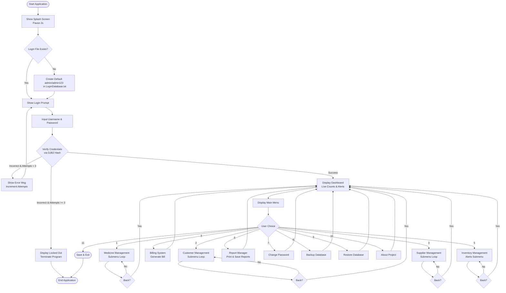

# System Flowchart

Below is the flowchart representing the execution flow of the Medical Store Management System.

```mermaid
graph TD
    Start([Start Application]) --> Splash[Show Splash Screen <br/> Pause 2s]
    Splash --> DBInit{Login File Exists?}
    
    DBInit -- No --> CreateDefaultAdmin[Create Default admin/admin123 <br/> in LoginDatabase.txt]
    DBInit -- Yes --> LoginPrompt[Show Login Prompt]
    CreateDefaultAdmin --> LoginPrompt
    
    LoginPrompt --> InputLogin[Input Username & Password]
    InputLogin --> VerifyLogin{Verify Credentials <br/> via DJB2 Hash}
    
    VerifyLogin -- Incorrect & Attempts < 3 --> FailMsg[Show Error Msg <br/> Increment Attempts]
    FailMsg --> LoginPrompt
    
    VerifyLogin -- Incorrect & Attempts >= 3 --> Lockout[Display Locked Out <br/> Terminate Program]
    Lockout --> End([End Application])
    
    VerifyLogin -- Success --> Dashboard[Display Dashboard <br/> Live Counts & Alerts]
    
    Dashboard --> MainMenu[Display Main Menu]
    
    MainMenu --> UserSelection{User Choice}
    
    %% Main Menu Routes
    UserSelection -->|1| MedMenu[Medicine Management <br/> Submenu Loop]
    UserSelection -->|2| CustMenu[Customer Management <br/> Submenu Loop]
    UserSelection -->|3| SuppMenu[Supplier Management <br/> Submenu Loop]
    UserSelection -->|4| Billing[Billing System <br/> Generate Bill]
    UserSelection -->|5| Inventory[Inventory Management <br/> Alerts Submenu]
    UserSelection -->|6| Reports[Report Manager <br/> Print & Save Reports]
    UserSelection -->|7| ChangePass[Change Password]
    UserSelection -->|8| Backup[Backup Database]
    UserSelection -->|9| Restore[Restore Database]
    UserSelection -->|10| About[About Project]
    UserSelection -->|11| Exit([Save & Exit])
    
    %% Submenu Operations
    MedMenu --> MedBack{Back?}
    MedBack -- No --> MedMenu
    MedBack -- Yes --> Dashboard
    
    CustMenu --> CustBack{Back?}
    CustBack -- No --> CustMenu
    CustBack -- Yes --> Dashboard
    
    SuppMenu --> SuppBack{Back?}
    SuppBack -- No --> SuppMenu
    SuppBack -- Yes --> Dashboard
    
    Billing --> Dashboard
    Inventory --> InvBack{Back?}
    InvBack -- No --> Inventory
    InvBack -- Yes --> Dashboard
    
    Reports --> Dashboard
    ChangePass --> Dashboard
    Backup --> Dashboard
    Restore --> Dashboard
    About --> Dashboard
    Exit --> End
```
